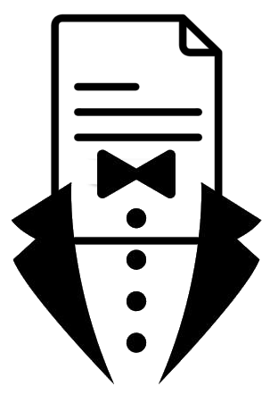
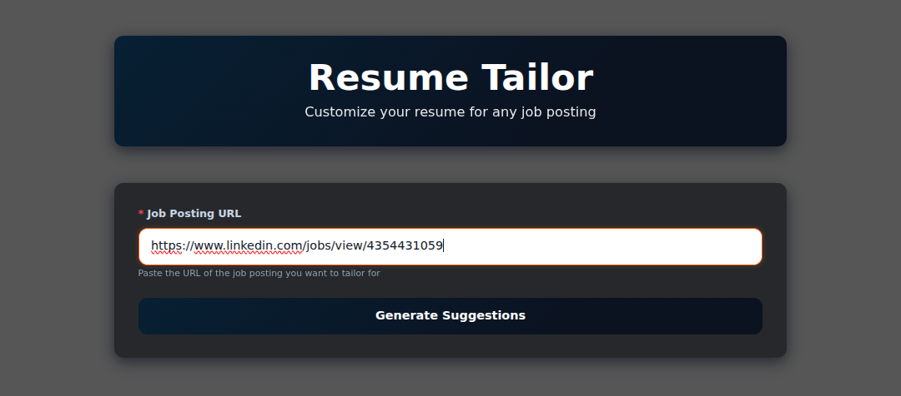
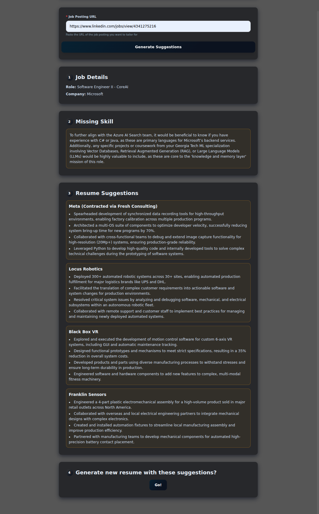

# Resume Tailor



Welcome! Ever wonder if spending lots of time tweaking your resume will increase your chances of hearing back from your job applications? This is that, but the lazy way. Use AI to read your resume and see what you might be missing on your resume to make you a good candidate and optimize the content that is there to be the best that it can be for a specific role. Finally, you can export your newly changed resume as a pdf and docx file with the click of a button.

## Workflow
Simply copy and paste a job posting in the box


and then get suggestions



# Local Quick Start:

1. Create a virtualenv and install dependencies:

```bash
python -m venv .venv
. .venv/bin/activate
pip install -r requirements.txt
```

2. Export your required environment variables:

```bash
export GOOGLE_API_KEY="<your_key>"
export RESOURCES_PATH="<path_to_resources_folder>"
export GOTENBURG_URL="<gotenburl_url>"
```

3. Run the app:

```bash
uvicorn app:app --reload --host 0.0.0.0 --port 8000
```

4. Open http://localhost:8000 and paste a job posting URL.

# Docker

```bash
docker build -t resume-automater source/
docker run -e GOOGLE_API_KEY="$GOOGLE_API_KEY" \
           -e RESOURCES_PATH="/resources" \
           -e GOTENBURG_URL="<gotenburl_url>" \
           -p 8000:8000 resume-automater 
```

## Example Resources Folder
You will need to supply a resources folder with the following
```
resources
├── config.json
├── Resume_Template.docx
└── prompts.json
```

Additionally the `config.json` has:
```
{
    "prompt_path": <prompt_json_path>,
    "pdf_resume_url": <hosted_pdf_resume_url>,
    "docx_resume_template_path": <path_to_docx_resume_to_modify>,
    "output": "<output_file_location>"
}
```

You can customize your prompts to be however you like inside of `prompts.json`, but you can see an [example one here](resources/prompts.json)